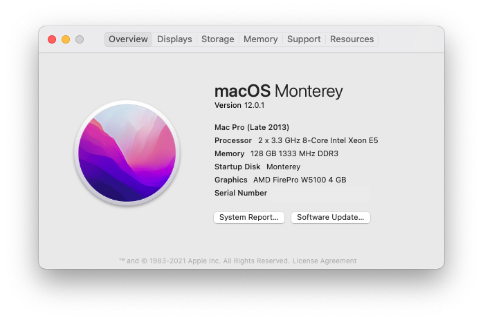
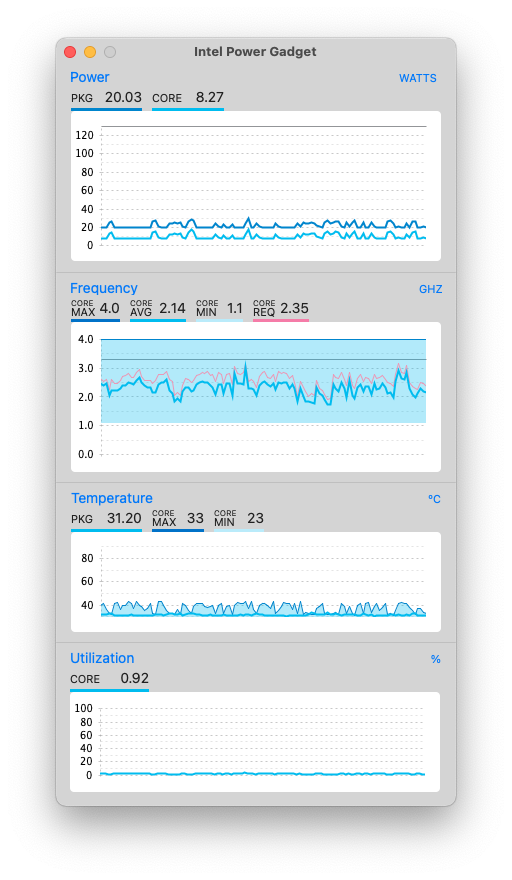

# ASRock  EP2C602-4L/D16 E5-2667v2 Hackintosh Guide

This guide works on macOS Monterey (12.0.1). C602 is even more complicated than X79 so I don't recommend beginners try this build.

For hardware configurations I mostly referenced this [guide](https://www.tonymacx86.com/threads/guide-asrock-rack-ep2c602.289060/).



## Hardware
| Item | Brand | Model | Driver | Comment |
|-----|-----|-----|-----|-----|
| Motherboard | ASRock | EP2C602-4L/D16 | | |
| CPU | Intel | Dual Xeon E5-2667v2 | | |
| RAM | Samsung | 16x8GB RECC DDR3L 1333 | | |
| dGPU | AMD | FirePro W5100 4GB | built-in | FakeID 0x665C1002 |
| Wireless | Fenvi| T919 | built-in | BCM94360CD |
| Ethernet | Intel | 82574L | built-in | Flash Subvendor ID|
| USB 3.0 | Inateck | KT4006 | built-in | FL1100 |
| SSD | Crucial | MX200 500GB | | |

## Firmware
### Flash BIOS
Unlike ASRock X79s, C602 motherboards have CFG locks. So you need to flash the BIOS to unlock it. Simply use [UEFIPatch](https://github.com/LongSoft/UEFITool/releases) to patch the original file from ASRock.
### Flash NIC
The motherboard has Intel 82574L which is natively supported. However the different subvendor ID prevents the system from loading the driver. So you need to use Linux to flash the EEPROM. (I'm using Ubuntu as an example)
```
su root
apt install ethtool
ifconfig
```
Find out which port are you using. In my case, it's `enp9s0`. Then run the following command:
```
ethtool -E enp9s0 magic 0x10D38086 offset 0x16 value 0x00
ethtool -E enp9s0 magic 0x10D38086 offset 0x17 value 0x00
ethtool -E enp9s0 magic 0x10D38086 offset 0x1A value 0xF6
ethtool -E enp9s0 magic 0x10D38086 offset 0x16 value 0x00
ethtool -E enp9s0 magic 0x10D38086 offset 0x17 value 0x00
ethtool -E enp9s0 magic 0x10D38086 offset 0x18 value 0x86
ethtool -E enp9s0 magic 0x10D38086 offset 0x19 value 0x80
```
**Note that the subvendor ID will be reverted back if you cut off the power supply. So prepare a permanent Ubuntu flash drive.**
## BIOS Setup
| Name | Option |
| --- | --- |
| VT-d | Disabled |
| Marvell 9230 | Disabled |
| SCU devices | Disabled |
| Serial Port 1 | Disabled |
| Serial Port 2 | Disabled |
| P State Coordination | SW_ALL |

* If you set P state coordination to HW_ALL, CPU PM will not work properly(of course).
## Post Installation
This ASRock motherboard doesn't have `bcfg` command in UEFI shell. So you need to first boot from USB and use another UEFI shell (OpenShell.efi won't work, The one in Clover works though) to add the boot menu. Assume that your EFI partition is `fs1`, run the following commands:
```
fs1:
cd \efi\boot
bcfg boot add 0 bootx64.efi "OpenCore"
```
Now you should be able to boot from SSD.

I have customized my USB Port files. However if your motherboard is different from mine, you may want to enable `USBInjectAll.kext` and do that again by yourself.

## Comments
1. `/EFI/CLOVER/ACPI/patched/SSDT-APIC.aml` fixes the APIC table, which is equivalent to "Patch APIC" in Clover. Unfortunately you have to do it manually in OpenCore. For more information see [this issue](https://github.com/dortania/bugtracker/issues/48)

2. `/EFI/CLOVER/ACPI/patched/SSDT-PM.aml` is the processor freq data generated by [ssdtPRGen](https://github.com/Piker-Alpha/ssdtPRGen.sh).

3. `/EFI/CLOVER/ACPI/patched/SSDT-RENAME.aml` renames GFX0 to GFX1, which is required to inject GPU fakeID. This file is PCIe slot specific. If you are using a different slot, you should follow this [guide](https://www.tonymacx86.com/threads/black-screen-with-macpro-6-1-or-imac-15-or-imac-17-system-definition.183113/). If you have better solutions please let me know.

## Intel Power Gadget
1. Extract installer
```
pkgutil --expand Install\ Intel\ Power\ Gadget.pkg ./tmp
```
2. Edit `./tmp/Distribution`, delete the following part
```
                if(!(system.sysctl('hw.packages') == '1')) {
                    my.result.title = 'Multiple CPU Packages Not Supported';
                    my.result.message = 'Intel® Power Gadget does not currently support systems with more than one CPU package.';
                    my.result.type = 'Fatal';
                    return false;
                }
```
3. Re-pack installer
```
pkgutil --flatten ./tmp Intel.pkg
```
4. Double click to install.

## Known Issue
USB 3.0 will interfere with Wi-Fi. No solution for now. Maybe a Faraday cage can work?

## Credits
- Apple for the macOS
- teamawesome for the initial idea of the guide
- Acidanthera for Lilu, Whatevergreen and VirtualSMC
- naveenkrdy for AppleMCEReporterDisabler
- Piker-Alpha for ssdtPRGen
