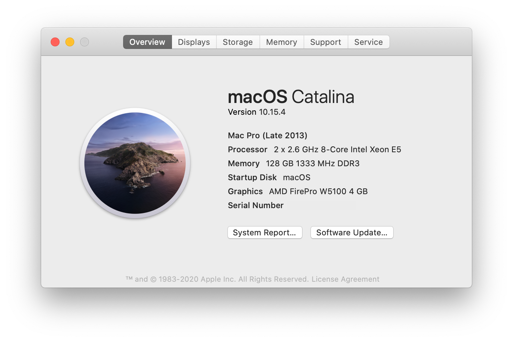

# ASRock  EP2C602-4L/D16 E5-2667v2 Hackintosh Guide

This guide works on macOS Catalina (10.15.4). C602 is even more complicated than X79 so I don't recommend beginners try this build.

I referenced this [guide](https://www.tonymacx86.com/threads/guide-asrock-rack-ep2c602.289060/) from teamawesome. This repo is the supplementary of my own setup.



## Hardware
| Item | Brand | Model | Driver | Comment |
|-----|-----|-----|-----|-----|
| Motherboard | ASRock | EP2C602-4L/D16 | | |
| CPU | Intel | Dual Xeon E5-2667v2 | | |
| RAM | Samsung | 16x8GB RECC DDR3L 1333 | | |
| dGPU | AMD | FirePro W5100 4GB | built-in | FakeID 0x665C1002 |
| Wireless | Fenvi| T919 | built-in | BCM94360CD |
| Ethernet | Intel | 82574L | built-in | Flash Subvendor ID|
| USB 3.0 | Inateck | KT4006 | built-in | FL1100 |
| SSD | Crucial | MX200 500GB | | |
| Monitor | Dell | U2720Q | | |

## Firmware
### Flash BIOS
Unlike ASRock X79s, C602 motherboards have CFG locks. So you need to flash the BIOS to unlock it. I'm providing my modified BIOS file in `Utilities/P602_4D1.90`. If you have other similar motherboard, simply use [UEFIPatch](https://github.com/LongSoft/UEFITool/releases) to patch it.
### Flash NIC
The motherboard has Intel 82574L which is natively supported. However the different subvendor ID prevents the system from loading the driver. So you need to use Linux to flash the EEPROM. (I'm using centOS as an example)
```
su root
yum install -y ethtool
ifconfig
```
Try to find out which port you are using. In my case, it's `enp9s0`. Then run the following command:
```
ethtool -E enp9s0 magic 0x10D38086 offset 0x16 value 0x00
ethtool -E enp9s0 magic 0x10D38086 offset 0x17 value 0x00
ethtool -E enp9s0 magic 0x10D38086 offset 0x1A value 0xF6
ethtool -E enp9s0 magic 0x10D38086 offset 0x16 value 0x00
ethtool -E enp9s0 magic 0x10D38086 offset 0x17 value 0x00
ethtool -E enp9s0 magic 0x10D38086 offset 0x18 value 0x86
ethtool -E enp9s0 magic 0x10D38086 offset 0x19 value 0x80
```
Note that the subvendor ID might be reverted back if you cut off the power supply
## BIOS Setup
| Name | Option |
| --- | --- |
| VT-d | Disabled |
| Marvell 9230 | Disabled |
| SCU devices | Disabled |
| Serial Port 1 | Disabled |
| Serial Port 2 | Disabled |

* These options must be disabled. There're more options which you can play around. teamawesome provided a page-by-page PDF to setup BIOS.
## Post Installation
I assume that you are not beginnners and know how to install Hackintosh. So I'm skipping all trivial steps.

This ASRock motherboard doesn't have `bcfg` command in UEFI shell. So you need first boot from USB and use the UEFI shell in Clover to add the boot menu. Assume that your EFI partition is `fs0`, run the following commands:
```
fs0:
cd \efi\boot
bcfg boot add 0 bootx64.efi "Clover"
reset
```
Now you should be able to boot from SSD.

I have customized my USB Port files. However if your motherboard is different from mine, you may want to use `USBInjectAll.kext` and do that again by yourself.

And you are all set.

## Comments
1. `/EFI/CLOVER/ACPI/patched/SSDT-1.aml` renames GFX0 to GFX1, which is neccesary to inject GPU fakeID on SMBIOS MacPro6,1. If your GPU is natively supoorted, you can remove this SSDT file and disable **ATI Fake ID**/**Inject ATI** in Colver. This file is PCIe slot specific. If you are using a different slot, you should follow this [guide](https://www.tonymacx86.com/threads/black-screen-with-macpro-6-1-or-imac-15-or-imac-17-system-definition.183113/).

2. `/EFI/CLOVER/ACPI/patched/ssdt.aml` is the processor data generated by [ssdtPRGen](https://github.com/Piker-Alpha/ssdtPRGen.sh). I'm enforcing the CPUs running in XCPM mode, which means only LFM, base and turbo frequencies are available.

## Known Issue
**PatchAPIC** has to be enabled in Clover to boot into the system.

## Credits
- Apple for the macOS
- teamawesome for the initial idea of the guide
- CloverHackyColor for CloverBootloader
- Acidanthera for Lilu, Whatevergreen and VirtualSMC
- naveenkrdy for AppleMCEReporterDisabler
- Piker-Alpha for ssdtPRGen
